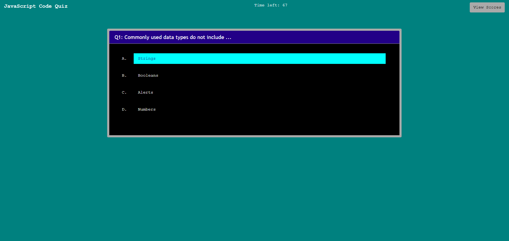
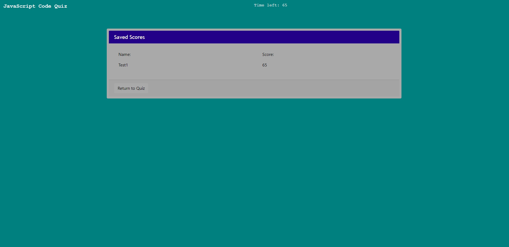

# 04 JavaScript Code Quiz
This contains content for BCS Homework 4: JS Code Quiz

The task for this project was to create a JavaScript Code Quiz website using JavaScript. It required a series of questions and answers, a timer, and the ability to save and load scores to/from local storage.
The page had to be dynamic, with responsive sizing and use of JavaScript to alter HTML elements and CSS styles.

No pre-made files were available for this, save for this:
.
This was a tricky task, in terms of working out the logic to run the quiz and display each set of questions and multiple-choice answers, and determining correct or incorect user choices. Also, I had some difficulty with the interval/timer, and the processes around saving, loading, and displaying/hiding the scores. 

### Page Previews
The main quiz interface:

The score sheet interface:

### Deployed Site
The JavaScript Code Quiz is available [here](https://arbdt.github.io/code-quiz/).